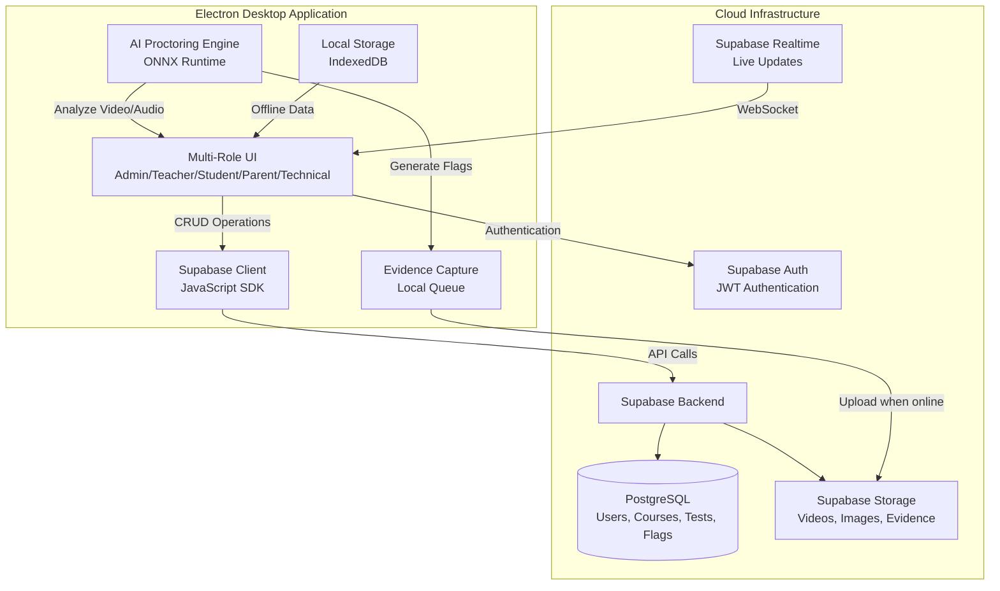

# ProctorWatch - AI-Based Student Proctoring System
## Implementation Plan

A production-oriented prototype for an AI-powered online examination and proctoring system with identity verification, behavior monitoring, exam management, and multi-stakeholder access.

---

## User Review Required

> [!IMPORTANT]
> **Technology Stack Decisions Required**
> 
> Please review and confirm the proposed technology choices below. These will significantly impact development speed, scalability, and maintenance:
> 
> - **Backend Framework**: Node.js + Express or Python + FastAPI
> - **Frontend Framework**: React or Vue.js
> - **Desktop Wrapper**: Electron (for cross-platform deployment)
> - **Database**: PostgreSQL (relational) + MongoDB (evidence storage)
- **AI Runtime**: ONNX Runtime Web (Offline-first, models served locally)

> [!IMPORTANT]
> **Deployment Model - Electron Application**
> 
> The entire system is built as an **Electron desktop application** that:
> 1. Runs locally on all user devices (Admin, Teacher, Student, Parent, Technical)
> 2. Connects to **Supabase** cloud backend for data sync
> 3. Provides offline-first capabilities for exam-taking
> 4. Uses local AI inference (ONNX Runtime) for proctoring
> 5. Syncs evidence and data when online
> 
> **Benefits**: Cross-platform (Windows/Mac/Linux), consistent UI, offline capable, secure.

> [!CAUTION]
> **Legal & Privacy Compliance**
> 
> This system processes biometric data, audio/video recordings, and student behavior analytics. You must:
> - Obtain legal review for GDPR, FERPA, COPPA compliance
> - Implement explicit consent workflows
> - Define data retention and deletion policies
> - Ensure secure storage with encryption at rest and in transit
> 
> **Recommendation**: Consult with legal counsel before production deployment.

---

## Proposed Changes

### System Architecture

#### High-Level Architecture



---

### Technology Stack

#### Backend - Supabase (Cloud BaaS)

**Database**: **Supabase** (PostgreSQL + Real-time + Storage + Auth)
- **Database**: PostgreSQL (managed, auto-backups)
- **Authentication**: Supabase Auth (JWT, RLS)
- **Storage**: Supabase Storage (S3-compatible, for videos/images)
- **Real-time**: Supabase Realtime (WebSocket subscriptions)
- **Edge Functions**: Deno-based serverless functions (optional for complex logic)
- **Row Level Security**: Built-in security policies

**Why Supabase**:
- All-in-one backend (no separate server needed)
- Real-time subscriptions for live monitoring
- Built-in authentication and authorization
- Generous free tier for prototyping
- PostgreSQL for relational data integrity
- Client libraries for JavaScript/TypeScript

**Client SDK**: `@supabase/supabase-js` (used in Electron app)

---

#### Frontend - Electron Application

**Framework**: **React** with TypeScript (inside Electron)
- **Desktop Runtime**: Electron (latest stable)
- **Renderer Process**: React 18+ with TypeScript
- **UI Library**: Material-UI (MUI) or shadcn/ui
- **State Management**: Zustand or Redux Toolkit
- **Forms**: React Hook Form + Zod validation
- **Tables**: TanStack Table (bulk operations)
- **Calendar**: FullCalendar (exam scheduling)
- **Charts**: Recharts (performance dashboards)
- **Supabase Client**: `@supabase/supabase-js`
- **IPC Communication**: Electron IPC (Renderer ↔ Main process)

---

#### Electron Architecture

**Main Process** (Node.js environment):
- System-level operations (camera, mic, filesystem)
- Background monitors (device, network)
- IPC handlers for renderer communication
- Auto-update management (electron-updater)
- Security policies (CSP, sandbox)

**Renderer Process** (Browser environment):
- React UI for all dashboards
- WebRTC for camera/mic access
- ONNX Runtime for AI inference
- IndexedDB for offline storage
- Supabase client for cloud sync

---

#### AI/ML Stack (Offline Proctoring)

**Runtime**: **ONNX Runtime** (cross-platform, optimized)

**Models**:
1. **Face Detection**: MediaPipe Face Detection (ONNX export)
2. **Face Recognition**: InsightFace ArcFace model (ONNX)
3. **Face Landmark**: MediaPipe FaceMesh (468 landmarks)
4. **Head Pose**: OpenCV solvePnP (from landmarks)
5. **Voice Activity Detection**: WebRTC VAD or Silero VAD (ONNX)
6. **Object Detection**: YOLOv8-nano (for phone/person detection)

**Computer Vision**: OpenCV.js (WebAssembly for browser)

**Audio Processing**: Web Audio API + Worklets

---

#### Database Schema (Supabase PostgreSQL)

**Core Tables**:
- `users` (id, email, username, password_hash, role, phone, profile_photo_url, created_at)
- `consents` (id, user_id, consent_type, accepted_at, ip_address)
- `face_registrations` (id, user_id, embeddings_json, landmarks_json, quality_score, registered_at)
- `institutions` (id, name, settings_json)
- `courses` (id, institution_id, name, code, teacher_id)
- `enrollments` (id, course_id, student_id, enrolled_at)
- `tests` (id, course_id, title, start_time, end_time, duration_minutes, settings_json)
- `questions` (id, test_id, question_text, type, options_json, correct_answer_json, marks, negative_marks)
- `exam_sessions` (id, test_id, student_id, started_at, ended_at, status, score, flagged)
- `answers` (id, session_id, question_id, answer_json, is_correct, marks_awarded)
- `flags` (id, session_id, type, severity, timestamp, confidence, metadata_json, evidence_url)
- `module_overrides` (id, session_id, admin_id, disabled_modules_json, reason, timestamp, applied_at)
- `audit_logs` (id, action, user_id, target_type, target_id, details_json, timestamp)

**Default Admin Credentials** (seeded on setup):
- Username: `admin@pw.com`
- Password: `Admin@123` (must change on first login)
- Role: `admin`

**Supabase Storage Buckets** (Files)

**Buckets**:
- `evidence-videos` (video clips for flags, organized by session_id/flag_id)
- `profile-photos` (user profile pictures)
- `telemetry-data` (session performance data as JSON files)

**Storage Policies**:
- Students: Read own profile photo only
- Teachers: Read evidence for their courses
- Admins: Full access
- Technical: Full access

---

### Module Implementation Details

---

#### 1. Authentication & User Management

**[NEW]** [auth.service.js](file:///c:/Users/gandh/Desktop/Krish/ACM/PW%203.0/backend/services/auth.service.js)

**Features**:
- Email to username conversion (`example@gmail.com` → `example@pw.com`)
- Phone number as default password
- First login detection and mandatory actions flow
- Password change enforcement
- JWT token generation and validation
- Role-based access control middleware

**First Login Flow**:
```javascript
// Pseudocode
if (user.first_login) {
  return {
    requires: ['password_change', 'profile_photo', 'consent'],
    student_additional: ['face_registration']
  }
}
```

**RBAC Middleware**:
```javascript
// Express middleware
const requireRole = (roles) => {
  return (req, res, next) => {
    if (!roles.includes(req.user.role)) {
      return res.status(400).json({ error: 'Forbidden' })
    }
    next()
  }
}
```

---

**[NEW]** [user.controller.js](file:///c:/Users/gandh/Desktop/Krish/ACM/PW%203.0/backend/controllers/user.controller.js)

**Endpoints**:
- `POST /api/auth/login` - Authenticate user
- `POST /api/auth/change-password` - First login password change
- `POST /api/auth/upload-profile-photo` - Upload photo (S3/MinIO)
- `POST /api/auth/accept-consent` - Log consent acceptance
- `GET /api/users/me` - Get current user profile
- `PUT /api/users/me` - Update profile

---

#### 2. Face Registration System (Students)

**[NEW]** [FaceRegistration.jsx](file:///c:/Users/gandh/Desktop/Krish/ACM/PW%203.0/frontend/src/components/FaceRegistration.jsx)

**Frontend Workflow**:
1. Display instructions (well-lit area, no obstruction, center face)
2. Start camera feed
3. Detect face using MediaPipe Face Detection
4. Check quality:
   - Single face present
   - Frontal pose (within 15° rotation)
   - Good lighting (brightness threshold)
   - No obstruction (landmark visibility)
5. Capture 5-10 frames over 3 seconds
6. Extract embeddings using InsightFace model
7. Store average embedding + landmarks

**Storage**:
```javascript
{
  user_id: 123,
  embeddings: [0.123, -0.456, ...], // 512-dim vector
  landmarks: [[x1, y1], [x2, y2], ...], // 468 points
  quality_score: 0.92,
  registered_at: "2026-02-12T18:51:24Z"
}
```

---

**[NEW]** [face.service.js](file:///c:/Users/gandh/Desktop/Krish/ACM/PW%203.0/backend/services/face.service.js)

**API**:
- `POST /api/face/register` - Store face embeddings
- `POST /api/face/verify` - Verify face during pre-test

---

#### 3. Role-Based Dashboards

---

##### 3a. Technical Dashboard (Superuser)

**[NEW]** [TechnicalDashboard.jsx](file:///c:/Users/gandh/Desktop/Krish/ACM/PW%203.0/frontend/src/pages/TechnicalDashboard.jsx)

**Features**:
- **Raw SQL Query Interface**: Execute SELECT queries with results table
- **Schema Visualization**: Mermaid diagram of all tables
- **System Metrics**: CPU, memory, disk, active connections
- **Model Status**: AI model versions, load times, inference speed
- **Device Telemetry**: Client device stats aggregation
- **Logs Viewer**: Real-time log streaming with filtering
- **Override Panel**: Emergency controls (disable proctoring modules globally)

**Security**: Requires `role = 'technical'` + additional password verification.

---

##### 3b. Admin Dashboard

**[NEW]** [AdminDashboard.jsx](file:///c:/Users/gandh/Desktop/Krish/ACM/PW%203.0/frontend/src/pages/AdminDashboard.jsx)

**Features**:

**User Management**:
- Create teachers, other admins, technical users (form)
- CSV bulk upload for students (with validation)
- User list with search, filter, edit, deactivate

**Course Management**:
- Create courses (name, code, description)
- Assign teachers to courses
- Student allocation interface (drag-drop or bulk select)
- Bulk reallocation (CSV or multi-select)

**Live Monitoring**:
- Active exam sessions table (student, course, time remaining, flag count)
- Suspend/resume exam controls
- Real-time flag stream

**Reporting**:
- Export institutional reports (CSV/PDF)
  - Test completion rates
  - Average integrity scores
  - Flagged exams summary

---

##### 3c. Teacher Dashboard

**[NEW]** [TeacherDashboard.jsx](file:///c:/Users/gandh/Desktop/Krish/ACM/PW%203.0/frontend/src/pages/TeacherDashboard.jsx)

**Features**:

**Course View**:
- List of assigned courses
- Student roster per course

**Test Creation**:
- Test metadata form (title, duration, start/end time)
- Question builder:
  - MCQ single correct (radio buttons)
  - MCQ multiple correct (checkboxes)
  - Rich text editor for questions (support images)
  - Marks allocation
  - Negative marking (optional)
- Question bank (reusable questions)
- Extra time allocation for specific students

**Live Monitoring**:
- Active test sessions for their courses
- Real-time flag notifications
- Student camera feed (optional, if enabled)

**Review & Grading**:
- Flagged exams list with severity filters
- Evidence viewer (video clips with timestamp)
- Manual grading override
- Comments and feedback

**Student History**:
- Past performance per student
- Flag history trends
- Comparison charts

---

##### 3d. Parent Dashboard

**[NEW]** [ParentDashboard.jsx](file:///c:/Users/gandh/Desktop/Krish/ACM/PW%203.0/frontend/src/pages/ParentDashboard.jsx)

**Features**:
- Child selector (if multiple children)
- Performance summary:
  - Recent test scores (chart)
  - Attendance percentage
  - Integrity score (average of non-flagged exams)
- Upcoming exams calendar (FullCalendar integration)
- Teacher contact information (email, phone)
- Flag summary (without detailed evidence for privacy)

**Note**: Read-only access, no actions.

---

##### 3e. Student Dashboard

**[NEW]** [StudentDashboard.jsx](file:///c:/Users/gandh/Desktop/Krish/ACM/PW%203.0/frontend/src/pages/StudentDashboard.jsx)

**Features**:
- Profile section:
  - View/edit profile photo
  - Change password
  - View registered face status
- Upcoming exams:
  - Calendar view
  - "Start Exam" button (appears 5 minutes before)
  - Exam details (duration, topics, instructions)
- Past results:
  - Scores
  - Percentile (if enabled)
  - Review correct/incorrect answers (if teacher allows)
- Flag history:
  - List of flagged exams
  - Severity and reason (transparent feedback)

---

#### 4. Course & Enrollment Management

**[NEW]** [course.controller.js](file:///c:/Users/gandh/Desktop/Krish/ACM/PW%203.0/backend/controllers/course.controller.js)

**Endpoints**:
- `POST /api/courses` - Create course (admin)
- `GET /api/courses` - List courses (role-filtered)
- `PUT /api/courses/:id` - Update course
- `DELETE /api/courses/:id` - Delete course
- `POST /api/courses/:id/enroll` - Enroll students (bulk)
- `GET /api/courses/:id/students` - Get enrolled students
- `PUT /api/courses/:id/assign-teacher` - Assign teacher

**Bulk Enrollment**:
- CSV upload with columns: `student_email, course_code`
- Validation: user exists, email valid, not already enrolled
- Return success/error report

---

#### 5. Test Creation & Scheduling

**[NEW]** [test.controller.js](file:///c:/Users/gandh/Desktop/Krish/ACM/PW%203.0/backend/controllers/test.controller.js)

**Test Schema**:
```javascript
{
  id: 1,
  course_id: 5,
  title: "Midterm Exam",
  start_time: "2026-02-15T10:00:00Z",
  end_time: "2026-02-15T12:00:00Z",
  duration_minutes: 120,
  settings: {
    randomize_questions: false,
    randomize_options: true,
    allow_resume: false,
    show_results_immediately: false,
    proctoring_enabled: true,
    extra_time_students: {
      "student123": 30 // 30 extra minutes
    }
  }
}
```

**Question Schema**:
```javascript
{
  id: 1,
  test_id: 1,
  question_text: "What is 2+2?",
  type: "MCQ_SINGLE",
  options: ["3", "4", "5", "6"],
  correct_answer: ["4"], // array for multi-correct support
  marks: 4,
  negative_marks: 1
}
```

**Endpoints**:
- `POST /api/tests` - Create test
- `GET /api/tests/:id` - Get test details
- `POST /api/tests/:id/questions` - Add questions (bulk)
- `PUT /api/tests/:id/schedule` - Update schedule
- `GET /api/courses/:courseId/tests` - List tests for course

---

#### 6. Pre-Test Diagnostic Flow

**[NEW]** [PreTestCheck.jsx](file:///c:/Users/gandh/Desktop/Krish/ACM/PW%203.0/desktop-client/src/components/PreTestCheck.jsx)

**Timing**: Allows entry 5 minutes before exam start.

**Checks** (Sequential):

1. **Camera Test**:
   - Detect camera
   - Start video stream
   - Display preview
   - ✅ Pass: Camera working

2. **Microphone Test**:
   - Request mic permission
   - Record 3 seconds
   - ✅ Pass: Audio detected

3. **Speaker Test**:
   - Play test audio
   - User confirms heard it
   - ✅ Pass: User confirmation

4. **Face Detection**:
   - Detect single face
   - ❌ Fail if: No face, multiple faces
   - ✅ Pass: Exactly one face

5. **Face Recognition**:
   - Fetch registered embedding from API
   - Compute cosine similarity
   - ❌ Fail if: Similarity < 90%
   - ✅ Pass: Match ≥ 90%

6. **Lighting Check**:
   - Analyze frame brightness
   - ❌ Fail if: Too dark/bright
   - ✅ Pass: Acceptable range

7. **Environment Setup**:
   - Instruction: Remove obstructions, ensure quiet room
   - User confirms ready

**Outcome**:
- **All Pass**: Admit to exam
- **Any Fail**: Show error, retry, or contact admin

---

#### 7. Exam Interface (Desktop Client)

**[NEW]** [ExamWindow.jsx](file:///c:/Users/gandh/Desktop/Krish/ACM/PW%203.0/desktop-client/src/components/ExamWindow.jsx)

**UI Elements**:
- **Header**:
  - Exam title
  - Timer (countdown, synced with server)
  - Current question number
  - Question palette (grid of question numbers, color-coded: unanswered, answered, marked for review)
  
- **Main Area**:
  - Question text
  - Options (radio/checkbox based on type)
  - "Mark for Review" checkbox
  - "Clear Response" button
  - Navigation: Previous, Next, Submit

- **Footer**:
  - Camera indicator (green = active)
  - Microphone indicator
  - Network status
  - Warning banner (if flags triggered)

- **Hidden Admin Menu** (top-right corner, triple-click):
  - Admin login prompt
  - Module disable controls (if authenticated)

**Auto-Submit**:
- When timer reaches 00:00
- Or when student clicks "Submit" and confirms

**Data Sync**:
- Save answers locally (IndexedDB) every 10 seconds
- Upload to server every 30 seconds (if online)
- Final submit uploads all answers + session metadata

---

#### 8. Proctoring Engine Architecture

**[NEW]** [ProctoringEngine.js](file:///c:/Users/gandh/Desktop/Krish/ACM/PW%203.0/desktop-client/src/proctoring/ProctoringEngine.js)

**Design**: Modular system with independent monitors running in Web Workers.

**Modules**:
1. **IdentityMonitor** (vision)
2. **DeviceMonitor** (system events)
3. **BehaviorMonitor** (gaze, pose)
4. **AudioMonitor** (voice detection)
5. **NetworkMonitor** (traffic analysis)

**Workflow**:
1. Initialize all modules on exam start
2. Each module runs inference independently
3. Emit events to `FlagManager`
4. `FlagManager` classifies severity (red/orange)
5. `EvidenceCapture` records clips for flags
6. Red flags → terminate exam immediately
7. Orange flags → log and continue

---

##### 8a. Identity Monitor

**[NEW]** [IdentityMonitor.js](file:///c:/Users/gandh/Desktop/Krish/ACM/PW%203.0/desktop-client/src/proctoring/IdentityMonitor.js)

**Responsibilities**:
- Detect face presence
- Verify identity match
- Detect multiple faces
- Detect face obstruction

**Models Used**:
- MediaPipe Face Detection (face bounding box)
- InsightFace ArcFace (512-dim embedding)

**Inference Loop** (runs every 1 second):
```javascript
1. Capture frame from webcam
2. Run face detection
3. If no face detected for >5 seconds → RED FLAG
4. If >1 face detected for >3 seconds → RED FLAG
5. Extract embedding from detected face
6. Compute cosine similarity with registered embedding
7. If similarity < 90% for >3 frames → RED FLAG
8. Check landmark visibility (for obstruction)
9. If <80% landmarks visible → ORANGE FLAG
```

**Thresholds** (configurable):
- Face missing tolerance: 5 seconds
- Multi-face tolerance: 3 seconds
- Identity threshold: 90% similarity
- Obstruction threshold: 80% landmarks visible

---

##### 8b. Device Monitor

**[NEW]** [DeviceMonitor.js](file:///c:/Users/gandh/Desktop/Krish/ACM/PW%203.0/desktop-client/src/proctoring/DeviceMonitor.js)

**Responsibilities**:
- Detect window focus loss
- Detect tab switches
- Detect new applications
- Detect copy/paste
- Detect keyboard shortcuts (Ctrl+C, Alt+Tab, etc.)
- Detect screen capture attempts
- Detect developer tools open
- Detect virtual machine environment
- Detect camera/mic disconnect

**Implementation** (Electron Main Process):

```javascript
// Window focus
mainWindow.on('blur', () => {
  sendFlag('FOCUS_LOSS', 'RED')
})

// Prevent certain shortcuts
mainWindow.webContents.on('before-input-event', (event, input) => {
  const forbidden = ['CmdOrCtrl+C', 'CmdOrCtrl+V', 'Alt+Tab', 'F12']
  if (forbidden.includes(input.key)) {
    event.preventDefault()
    sendFlag('KEYBOARD_SHORTCUT', 'RED')
  }
})

// Detect VM (check BIOS strings, registry keys on Windows)
const isVM = checkVirtualMachine()
if (isVM) sendFlag('VIRTUAL_MACHINE', 'RED')

// Monitor media devices
navigator.mediaDevices.addEventListener('devicechange', () => {
  const hasCamera = checkCamera()
  const hasMic = checkMic()
  if (!hasCamera) sendFlag('CAMERA_UNPLUGGED', 'RED')
  if (!hasMic) sendFlag('MIC_UNPLUGGED', 'RED')
})
```

**Browser API Detection**:
- Override `document.addEventListener('visibilitychange')` to detect tab switches
- Monitor clipboard events
- Detect DevTools with `window.outerHeight - window.innerHeight > 100`

---

##### 8c. Behavior Monitor

**[NEW]** [BehaviorMonitor.js](file:///c:/Users/gandh/Desktop/Krish/ACM/PW%203.0/desktop-client/src/proctoring/BehaviorMonitor.js)

**Responsibilities**:
- Track head pose (yaw, pitch, roll)
- Detect looking away
- Detect side glances
- Detect downward gaze
- Detect lip movement

**Models Used**:
- MediaPipe FaceMesh (468 landmarks)

**Head Pose Estimation**:
```javascript
// Use solvePnP from OpenCV
const modelPoints = [...] // 6 key facial points (nose, chin, eyes, mouth)
const imagePoints = landmarks // from FaceMesh
const rotationVector = cv.solvePnP(modelPoints, imagePoints, cameraMatrix)
const yaw = rotationVector[1] // left/right rotation
const pitch = rotationVector[0] // up/down rotation
```

**Gaze Detection**:
```javascript
// Thresholds
const LOOKING_AWAY_YAW = 30° // degrees
const LOOKING_DOWN_PITCH = 20°
const SIDE_GLANCE_YAW = 45°

if (Math.abs(yaw) > LOOKING_AWAY_YAW) {
  incrementCounter('looking_away')
  if (counter > 5 consecutive) → ORANGE FLAG
}

if (pitch > LOOKING_DOWN_PITCH) {
  // Could be looking at phone or notes
  → ORANGE FLAG
}
```

**Lip Movement Detection**:
```javascript
// Track mouth landmarks distance over time
const mouthOpen = distance(landmarks[13], landmarks[14]) // upper/lower lip
if (mouthOpen > threshold && varies over time) {
  → ORANGE FLAG ('LIP_MOVEMENT')
}
```

---

##### 8d. Audio Monitor

**[NEW]** [AudioMonitor.js](file:///c:/Users/gandh/Desktop/Krish/ACM/PW%203.0/desktop-client/src/proctoring/AudioMonitor.js)

**Responsibilities**:
- Detect human voice
- Detect whisper patterns
- Background noise analysis

**Implementation**:

**Voice Activity Detection (VAD)**:
- Use Web Audio API to analyze microphone input
- Run Silero VAD model (ONNX) on audio chunks
- Output: probability of speech in current chunk

```javascript
const audioContext = new AudioContext()
const analyser = audioContext.createAnalyser()
analyser.fftSize = 2048

// Process audio in 200ms chunks
setInterval(async () => {
  const audioData = getAudioData(analyser)
  const speechProbability = await runVAD(audioData)
  
  if (speechProbability > 0.7) {
    → ORANGE FLAG ('VOICE_DETECTED')
    recordEvidence(audioData, 10000) // 10 sec clip
  }
}, 200)
```

**Whisper Detection** (heuristic):
- Check if energy is low but speech pattern detected
- Multiple short speech bursts → suspected whisper

---

##### 8e. Network Monitor

**[NEW]** [NetworkMonitor.js](file:///c:/Users/gandh/Desktop/Krish/ACM/PW%203.0/desktop-client/src/proctoring/NetworkMonitor.js)

**Responsibilities**:
- Detect VPN usage
- Detect proxy
- Detect remote desktop (TeamViewer, AnyDesk)
- Monitor network traffic anomalies
- Detect network interface changes

**Implementation** (Electron Main Process):

```javascript
// VPN/Proxy Detection
const os = require('os')
const networkInterfaces = os.networkInterfaces()

// Check for VPN adapter names
const vpnAdapters = ['tun', 'tap', 'vpn', 'wg0'] // common VPN interfaces
const hasVPN = Object.keys(networkInterfaces).some(name => 
  vpnAdapters.some(vpn => name.toLowerCase().includes(vpn))
)

if (hasVPN) → RED FLAG ('VPN_DETECTED')

// Remote Desktop Detection (Windows)
const { exec } = require('child_process')
exec('tasklist', (err, stdout) => {
  const remoteTools = ['teamviewer', 'anydesk', 'rdpclip']
  if (remoteTools.some(tool => stdout.toLowerCase().includes(tool))) {
    → RED FLAG ('REMOTE_DESKTOP')
  }
})

// Network Change Detection
os.networkInterfaces() // compare with initial state
if (interfacesChanged) → ORANGE FLAG ('NETWORK_CHANGE')
```

**Traffic Monitoring**:
- Use Electron's `webContents.session.webRequest` to log all network requests
- Flag suspicious domains (e.g., ChatGPT, Quillbot)

---

#### 9. Flag Classification System

**[NEW]** [FlagManager.js](file:///c:/Users/gandh/Desktop/Krish/ACM/PW%203.0/desktop-client/src/proctoring/FlagManager.js)

**Responsibilities**:
- Receive events from all monitors
- Classify severity (RED vs ORANGE)
- Apply tolerance windows
- Escalate repeated orange flags
- Trigger exam termination for red flags
- Notify evidence capture

**Classification Logic**:

```javascript
const flagRules = {
  // RED FLAGS - Deterministic
  FACE_MISSING: { severity: 'RED', tolerance: 5000 }, // 5 seconds
  MULTI_FACE: { severity: 'RED', tolerance: 3000 },
  FACE_MISMATCH: { severity: 'RED', tolerance: 0 },
  TAB_SWITCH: { severity: 'RED', tolerance: 0 },
  FOCUS_LOSS: { severity: 'RED', tolerance: 0 },
  APP_OPENED: { severity: 'RED', tolerance: 0 },
  DEV_TOOLS: { severity: 'RED', tolerance: 0 },
  SCREEN_CAPTURE: { severity: 'RED', tolerance: 0 },
  VIRTUAL_MACHINE: { severity: 'RED', tolerance: 0 },
  CAMERA_UNPLUGGED: { severity: 'RED', tolerance: 0 },
  MIC_UNPLUGGED: { severity: 'RED', tolerance: 0 },
  REMOTE_DESKTOP: { severity: 'RED', tolerance: 0 },
  VPN_DETECTED: { severity: 'RED', tolerance: 0 },
  
  // ORANGE FLAGS - Contextual
  LOOKING_AWAY: { severity: 'ORANGE', tolerance: 10000 }, // 10 sec
  SIDE_GLANCE: { severity: 'ORANGE', escalateAfter: 5 },
  DOWNWARD_GAZE: { severity: 'ORANGE', escalateAfter: 3 },
  LIP_MOVEMENT: { severity: 'ORANGE', escalateAfter: 5 },
  VOICE_DETECTED: { severity: 'ORANGE', escalateAfter: 3 },
  OBSTRUCTION: { severity: 'ORANGE', tolerance: 5000 },
  POOR_LIGHTING: { severity: 'ORANGE', tolerance: 10000 },
  NETWORK_CHANGE: { severity: 'ORANGE', escalateAfter: 2 }
}

// Escalation
let orangeCounter = {}
function handleEvent(eventType, metadata) {
  const rule = flagRules[eventType]
  
  if (rule.severity === 'RED') {
    createFlag(eventType, 'RED', metadata)
    terminateExam()
  } else {
    orangeCounter[eventType] = (orangeCounter[eventType] || 0) + 1
    
    if (rule.escalateAfter && orangeCounter[eventType] >= rule.escalateAfter) {
      createFlag(eventType, 'RED', { ...metadata, escalated: true })
      terminateExam()
    } else {
      createFlag(eventType, 'ORANGE', metadata)
    }
  }
}
```

**Institutional Configuration**:
- Admins can customize thresholds via database settings
- Per-test override (e.g., disable audio monitoring for open-book tests)

---

#### 10. Evidence Capture System

**[NEW]** [EvidenceCapture.js](file:///c:/Users/gandh/Desktop/Krish/ACM/PW%203.0/desktop-client/src/proctoring/EvidenceCapture.js)

**Responsibilities**:
- Record video clips for each flag
- Capture device metadata
- Queue evidence for upload
- Handle offline scenarios

**Recording Strategy**:

```javascript
// Continuous buffering
const mediaRecorder = new MediaRecorder(stream, {
  mimeType: 'video/webm;codecs=vp9',
  videoBitsPerSecond: 500000 // 500 kbps for small files
})

// Circular buffer: keep last 30 seconds in memory
const buffer = new CircularBuffer(30000) // 30 sec

mediaRecorder.ondataavailable = (event) => {
  buffer.append(event.data)
}

// On flag event
function onFlagCreated(flag) {
  const clip = buffer.getClip({
    before: 5000, // 5 sec before flag
    after: 5000   // 5 sec after flag
  })
  
  const evidence = {
    flag_id: flag.id,
    session_id: currentSessionId,
    video_blob: clip,
    duration: 10000,
    timestamp: flag.timestamp,
    metadata: {
      event_type: flag.type,
      confidence: flag.confidence,
      device: getDeviceInfo()
    }
  }
  
  // Store locally first
  await saveToIndexedDB(evidence)
  
  // Queue for upload
  uploadQueue.add(evidence)
}
```

**Upload Strategy**:
- Upload immediately if online
- Queue locally if offline
- Retry with exponential backoff
- Checksum verification

**Device Metadata**:
```javascript
{
  os: 'Windows 11',
  cpu: 'Intel Core i5',
  ram: '8 GB',
  screen_resolution: '1920x1080',
  browser: 'Electron 28',
  camera: 'Logitech HD Pro C920',
  timestamp: '2026-02-15T10:23:45Z'
}
```

---

#### 11. Reporting & Analytics

**[NEW]** [ReportService.js](file:///c:/Users/gandh/Desktop/Krish/ACM/PW%203.0/backend/services/ReportService.js)

**Student-Level Reports**:
```javascript
{
  student_id: 123,
  test_id: 45,
  score: 85,
  total_marks: 100,
  percentile: 78,
  flags: {
    total: 3,
    red: 0,
    orange: 3,
    breakdown: {
      'LOOKING_AWAY': 2,
      'VOICE_DETECTED': 1
    }
  },
  integrity_score: 0.95, // based on flag severity
  time_taken: 7200, // seconds
  answers: [...] // question-wise breakdown
}
```

**Teacher-Level Reports**:
- Class average score
- Question difficulty analysis (% correct per question)
- Integrity distribution (histogram of flag counts)
- Outlier detection (students with unusually high flag counts)

**Admin-Level Reports**:
- Institution-wide metrics:
  - Total exams conducted
  - Average integrity score
  - Flagged exam % (red vs orange)
  - Top violation types
- Export formats: CSV, PDF, JSON

**Chart Examples**:
- Score distribution (histogram)
- Flags over time (line chart)
- Violation types (pie chart)
- Student performance trends (area chart)

---

#### 12. Live Admin Override Panel (During Exam)

**[NEW]** [AdminOverridePanel.jsx](file:///c:/Users/gandh/Desktop/Krish/ACM/PW%203.0/src/components/AdminOverridePanel.jsx)

**Access**: Hidden menu in exam UI (triple-click top-right corner during live exam)

**Workflow**:
1. Student triple-clicks top-right corner during exam
2. Hidden modal appears: "Admin Override Panel"
3. Admin authentication form:
   - Username input
   - Password input (secure)
   - Verify button
4. On successful authentication (admin/technical role):
   - Show module disable toggles
5. **Module Toggles** (checkboxes):
   - ☐ Video Monitoring (Identity + Behavior)
   - ☐ Audio Monitoring
   - ☐ Network Monitoring
   - ☐ Device Monitoring
   - ☐ All Proctoring (emergency disable)
6. **Reason Input**: Required text field for justification
7. **Apply Button**: 
   - Immediately disables selected modules
   - Saves to Supabase `module_overrides` table
   - Continues exam with reduced monitoring

**Real-time Application**:
```javascript
// When admin applies override
const applyOverride = async (sessionId, disabledModules, reason, adminId) => {
  // Save to database
  await supabase.from('module_overrides').insert({
    session_id: sessionId,
    admin_id: adminId,
    disabled_modules: disabledModules, // ['audio', 'network']
    reason: reason,
    applied_at: new Date().toISOString()
  })
  
  // Immediately stop selected monitors
  ProctoringEngine.disableModules(disabledModules)
  
  // Log action
  console.log(`Admin override applied: ${disabledModules.join(', ')} disabled`)
}
```

**Audit Trail**:
- All overrides logged in `module_overrides` table with timestamp
- Visible in admin & technical dashboards
- Exportable for compliance review
- Cannot be deleted (immutable audit log)

**Use Cases**:
- Student with disability needs assistive device (disable device monitor)
- Technical issue with camera (disable video temporarily)
- Open-book exam (disable network monitoring)
- Emergency situations

---

### Security Implementation

---

#### Transport Security

**HTTPS Everywhere**:
- Use Let's Encrypt for production
- Certificate pinning in Electron client

**API Security**:
```javascript
// Express middleware
app.use(helmet()) // Security headers
app.use(cors({
  origin: process.env.ALLOWED_ORIGINS.split(','),
  credentials: true
}))
app.use(express.json({ limit: '10mb' }))
app.use(rateLimit({
  windowMs: 15 * 60 * 1000, // 15 minutes
  max: 100 // limit each IP to 100 requests per windowMs
}))
```

**JWT Tokens**:
```javascript
{
  user_id: 123,
  role: 'student',
  exp: 1740000000, // 1 hour expiration
  iat: 1739996400
}

// Sign with RS256 (asymmetric)
const token = jwt.sign(payload, privateKey, { algorithm: 'RS256' })
```

---

#### Data Encryption

**At Rest**:
- PostgreSQL: Enable transparent data encryption (TDE)
- MongoDB: Enable encryption at rest
- File storage: Server-side encryption (S3: AES-256)

**In Transit**:
- TLS 1.3 for all API communication
- WebSocket Secure (WSS) for real-time features

**Client-Side**:
- Face embeddings encrypted before storage
- IndexedDB encrypted using SubtleCrypto API

---

#### Model Integrity

**Hash Verification**:
```javascript
// On model load
const model = await loadModel('face_recognition.onnx')
const hash = await computeSHA256(model)

if (hash !== EXPECTED_HASH) {
  throw new Error('Model tampered!')
}
```

**Signed Models**:
- Distribute models with digital signatures
- Verify signature before loading

---

#### Tamper Detection

**Client Integrity**:
```javascript
// Check if running in debugger
if (window.performance.now() - startTime > 100) {
  // Likely debugger attached
  → FLAG 'DEBUGGER_DETECTED'
}

// Check for DOM modifications
const observer = new MutationObserver((mutations) => {
  if (mutations.some(m => m.target.id === 'exam-container')) {
    → FLAG 'DOM_TAMPERED'
  }
})
```

**Secure Log Chain**:
- Chain flags with hash pointers (like blockchain)
- Each flag includes hash of previous flag
- Tamper-evident audit log

---

### Offline-First Architecture

---

#### Data Sync Strategy

**Exam Start**:
1. Student authenticates (requires internet)
2. Download exam questions + metadata
3. Store in IndexedDB
4. Start exam (now offline-capable)

**During Exam**:
1. Answers saved to IndexedDB every 10 seconds
2. Flags saved locally with evidence
3. If online: upload in background (non-blocking)
4. If offline: queue for later

**Exam End**:
1. Submit answers (requires internet)
2. Upload all queued evidence
3. If upload fails: retry with exponential backoff
4. Show "Submitting..." until confirmed

**Conflict Resolution**:
- Server timestamp is source of truth
- Client cannot extend exam time locally

---

#### Service Worker Strategy

**[NEW]** [service-worker.js](file:///c:/Users/gandh/Desktop/Krish/ACM/PW%203.0/desktop-client/public/service-worker.js)

```javascript
// Cache AI models
self.addEventListener('install', (event) => {
  event.waitUntil(
    caches.open('models-v1').then(cache => {
      return cache.addAll([
        '/models/face_detection.onnx',
        '/models/face_recognition.onnx',
        '/models/facemesh.onnx',
        '/models/vad.onnx',
        '/models/yolo.onnx'
      ])
    })
  )
})

// Network-first for API, cache-first for models
self.addEventListener('fetch', (event) => {
  if (event.request.url.includes('/models/')) {
    event.respondWith(
      caches.match(event.request).then(response => {
        return response || fetch(event.request)
      })
    )
  }
})
```

---

### Hardware Requirements & Optimization

---

#### Target Specifications

**Minimum**:
- Processor: Intel Core i3 / AMD Ryzen 3 (dual-core)
- RAM: 4 GB
- GPU: Integrated graphics (Intel UHD 620)
- Camera: 720p webcam
- Microphone: Built-in or USB
- Network: 1 Mbps download (for initial sync)
- Storage: 500 MB free space

**Recommended**:
- Processor: Intel Core i5 / AMD Ryzen 5 (quad-core)
- RAM: 8 GB
- GPU: Dedicated (NVIDIA GTX 1050 or better)
- Camera: 1080p webcam
- Network: 5 Mbps download

---

#### Performance Optimization

**AI Inference**:
- Use ONNX Runtime with WebAssembly backend (CPU)
- Use ONNX Runtime with WebGL backend (GPU acceleration)
- Model quantization: Convert FP32 → INT8 (4x smaller, faster)
- Run inference at 1 FPS (sufficient for proctoring)

**Video Processing**:
- Capture at 720p @ 15 FPS (not 30 FPS)
- Use hardware encoding (H.264)
- Compress evidence clips before upload

**Memory Management**:
- Limit circular buffer to 30 seconds
- Clear old evidence after upload
- Use Web Workers to offload AI inference (prevent UI blocking)

**Battery Optimization**:
- Reduce inference frequency on battery power
- Pause non-critical monitors if battery < 20%

---

#### Telemetry Collection

**[NEW]** [Telemetry.js](file:///c:/Users/gandh/Desktop/Krish/ACM/PW%203.0/desktop-client/src/utils/Telemetry.js)

**Metrics Collected** (every 30 seconds):
```javascript
{
  session_id: 123,
  timestamp: '2026-02-15T10:23:45Z',
  fps: 14.8, // video capture FPS
  cpu_usage: 45, // %
  memory_usage: 512, // MB
  battery_level: 75, // %
  inference_time: {
    face_detection: 25, // ms
    face_recognition: 40,
    facemesh: 30,
    vad: 10
  },
  network: {
    latency: 50, // ms
    upload_speed: 2.5 // Mbps
  }
}
```

**Use Cases**:
- Identify performance bottlenecks
- Optimize model choice per device tier
- False positive analysis (correlate flags with low FPS)

---

### Failure Handling

---

#### Camera Failure

**Scenario**: Camera disconnects mid-exam

**Response**:
1. Pause exam immediately
2. Display error: "Camera disconnected. Exam paused."
3. Notify admin in real-time (WebSocket)
4. Log incident with timestamp
5. If camera reconnects within 60 seconds:
   - Resume exam
   - Deduct paused time from total
6. If not reconnected:
   - Auto-submit with flag
   - Teacher reviews

---

#### Microphone Failure

**Scenario**: Mic unplugs

**Response** (similar to camera):
1. Pause exam
2. Notify admin
3. Grace period: 60 seconds
4. Resume or submit

---

#### Application Crash

**Scenario**: Electron app crashes

**Prevention**:
1. Save exam state to IndexedDB continuously
2. On restart, check for incomplete session
3. Prompt: "Resume previous exam?"
4. Restore state (questions, answers, timer)
5. Log crash with stack trace

**Crash Logging**:
```javascript
process.on('uncaughtException', (error) => {
  logCrash({
    session_id: currentSessionId,
    error: error.toString(),
    stack: error.stack,
    timestamp: new Date().toISOString()
  })
  
  // Graceful shutdown
  saveState()
  app.quit()
})
```

---

#### Network Failure

**Scenario**: Internet disconnects during exam

**Response**:
1. Continue exam (offline-first design)
2. Save all data locally
3. Display warning: "Offline - answers will upload when connected"
4. On reconnect:
   - Upload queued data
   - Sync server time
5. If offline at exam end:
   - Block final submit
   - Retry every 10 seconds
   - Show "Waiting for connection..."

---

#### Server Failure

**Scenario**: Backend API down

**Response**:
1. Retry API calls with exponential backoff
2. If exam not started yet: Show maintenance message
3. If exam in progress:
   - Continue locally
   - Queue all uploads
   - Extended submission deadline (automated)

---

### Deployment Strategy

---

#### Web Application Deployment

**Backend**:
- **Platform**: AWS/GCP/Azure
- **Service**: Docker containers on ECS/GKE/AKS
- **Database**: Managed PostgreSQL (RDS/Cloud SQL)
- **File Storage**: S3 or equivalent
- **CDN**: CloudFront for static assets
- **Load Balancer**: ALB/GLB for HA

**Frontend**:
- Build: `npm run build`
- Deploy to CDN (S3 + CloudFront or Vercel)
- Environment variables for API endpoints

**CI/CD**:
- GitHub Actions / GitLab CI
- Automated tests on PR
- Staging environment
- Blue-green deployment

---

#### Desktop Client Deployment

**Installer Creation**:
- **Tool**: electron-builder
- **Platforms**: Windows (.exe), macOS (.dmg), Linux (.AppImage)

**Build Process**:
```bash
npm run build:desktop
# Outputs:
# - dist/ProctorWatch-Setup-1.0.0.exe (Windows)
# - dist/ProctorWatch-1.0.0.dmg (macOS)
# - dist/ProctorWatch-1.0.0.AppImage (Linux)
```

**Installer Features**:
1. Pre-install checks:
   - OS version compatibility
   - Camera/mic availability
   - Disk space (500 MB)
   - RAM (4 GB minimum)
2. Model download:
   - Download AI models during installation
   - Verify checksums
3. Driver validation:
   - Test camera access
   - Test mic access
4. Desktop shortcut creation

**Auto-Update**:
```javascript
const { autoUpdater } = require('electron-updater')

autoUpdater.checkForUpdatesAndNotify()

autoUpdater.on('update-available', () => {
  // Notify user
})

autoUpdater.on('update-downloaded', () => {
  // Prompt user to restart
})
```

---

#### Model Deployment

**Storage**:
- Host models on CDN (versioned URLs)
- Fallback to bundled models in installer

**Update Strategy**:
- Check model version on app start
- Download if newer version available
- Validate hash before use

**Model Files** (approximate sizes):
- face_detection.onnx: 2 MB
- face_recognition.onnx: 25 MB
- facemesh.onnx: 5 MB
- vad.onnx: 1 MB
- yolo_nano.onnx: 4 MB
- **Total**: ~40 MB

---

### Implementation Phases

---

#### Phase 1: Foundation (Weeks 1-2)
- Setup project structure (monorepo with Nx or Turborepo)
- Database schema design and migrations
- Authentication system
- Basic RBAC middleware
- User management APIs

---

#### Phase 2: Dashboards (Weeks 3-4)
- Admin dashboard (course/user management)
- Teacher dashboard (test creation)
- Student dashboard (exam list)
- Parent dashboard (read-only)
- Technical dashboard (debug panel)

---

#### Phase 3: Exam System (Weeks 5-6)
- Test creation flow
- Question builder
- Scheduling system
- Exam interface UI (desktop client)
- Timer and navigation
- Answer submission

---

#### Phase 4: Proctoring Engine (Weeks 7-10)
- Face registration flow
- Pre-test diagnostic
- Identity Monitor (face detection + recognition)
- Device Monitor (focus, tab switch, etc.)
- Behavior Monitor (gaze, pose)
- Audio Monitor (VAD)
- Network Monitor (VPN, proxy)
- Flag Manager (classification)
- Evidence Capture (video recording)

---

#### Phase 5: Integration & Testing (Weeks 11-12)
- End-to-end testing
- Performance optimization
- Offline mode testing
- Security audit
- Accessibility compliance (WCAG 2.1)

---

#### Phase 6: Deployment & Documentation (Week 13)
- Build installers
- Deployment scripts
- User documentation
- Admin guides
- Video tutorials

---

## Verification Plan

### Automated Tests

**Backend**:
```bash
# Unit tests
npm run test:backend

# API tests (Postman/Newman)
newman run tests/api-tests.json

# Database tests
npm run test:db
```

**Frontend**:
```bash
# Component tests (React Testing Library)
npm run test:frontend

# E2E tests (Playwright)
npm run test:e2e
```

**Desktop Client**:
```bash
# Unit tests
npm run test:desktop

# Integration tests (Spectron)
npm run test:integration
```

**AI Models**:
```bash
# Model accuracy tests
python tests/test_models.py

# Performance benchmarks
python tests/benchmark_inference.py
```

---

### Manual Verification

**Browser Testing**:
1. Use browser_subagent to test all dashboards
2. Verify RBAC (attempt unauthorized access)
3. Test CSV upload (bulk enrollment)
4. Create and schedule a test
5. Verify calendar displays correctly

**Desktop Client Testing**:
1. Install on target hardware (min spec)
2. Complete face registration
3. Run pre-test diagnostic
4. Take mock exam
5. Trigger each flag type intentionally:
   - Look away → ORANGE
   - Open new app → RED
   - Use phone → ORANGE (if detected)
6. Verify evidence captures correctly
7. Test offline mode (disconnect network)
8. Test crash recovery (force quit)

**Performance Testing**:
1. Measure FPS during exam (should be ≥14)
2. Measure CPU usage (should be <60% on min spec)
3. Measure memory usage (should be <1 GB)
4. Measure battery drain (laptop test)

**Security Testing**:
1. Attempt SQL injection
2. Test CSRF protection
3. Verify JWT expiration
4. Test model tampering (modify hash)
5. Attempt to bypass proctoring (use VM, remote desktop)

---

### User Acceptance Testing

**Stakeholder Review**:
1. **Admin**: Create courses, upload students, monitor exams
2. **Teacher**: Create test, review flagged exam
3. **Student**: Take exam, view results
4. **Parent**: View child's performance

**Feedback Collection**:
- User survey (SUS - System Usability Scale)
- Bug reports (GitHub Issues)
- Feature requests (prioritize for Phase 2)

---

### Compliance Verification

**Legal Review**:
- Data privacy policy (GDPR/FERPA compliance)
- Consent forms (review with legal)
- Data retention policy
- Right to access/delete data

**Accessibility**:
- Screen reader compatibility (NVDA/JAWS)
- Keyboard navigation
- Color contrast (WCAG AA)
- Caption support (for audio instructions)

---

### Documentation Verification

#### Tech Stack Setup
- [ ] Install `onnxruntime-web`
- [ ] Setup `public/models` directory for **Offline Model Serving**
- [ ] Download models (Scrfd, ArcFace, YOLOv8) to local storage
- [ ] Configure `env` to point to local model paths (e.g. `/models/scrfd.onnx`)
- [ ] Test cross-platform compatibility (Electron protocol handling), maintain
**User Guides**:
- [ ] Student: How to register face, take exam
- [ ] Teacher: How to create test, review flags
- [ ] Admin: How to manage institution
- [ ] Technical: How to deploy, maintain

**Developer Docs**:
- [ ] API reference (OpenAPI/Swagger)
- [ ] Database schema diagram
- [ ] Architecture diagrams
- [ ] Contributing guide

---

## Next Steps

Once you review and approve this plan, I will:

1. **Create detailed file structure** for the entire project
2. **Set up the development environment** (monorepo, dependencies)
3. **Begin implementation** starting with Phase 1 (Foundation)
4. **Provide regular progress updates** via task.md

Please review the plan and let me know:
1. **Technology stack preferences** (Node.js vs Python for backend?)
2. **Deployment model confirmation** (hybrid web + desktop?)
3. **Any additional requirements** or modifications needed
4. **Priority features** if timeline needs adjustment

---

**Estimated Timeline**: 13 weeks (3 months) for MVP
**Team Size Assumption**: 3-4 developers (full-stack + ML engineer)
**Budget Considerations**: Cloud infrastructure, AI model licenses, third-party services (if any)
