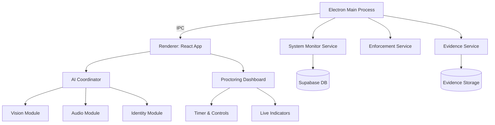

# ProctorWatch Advanced Proctoring System - Master Reimplementation Plan

> **Purpose**: Comprehensive plan for improving and/or reimplementing the AI-based proctoring system from scratch, addressing glitches and optimizing architecture.

---

## Executive Summary

Yesterday's implementation created **5 major proctoring modules**:
1. **Vision Intelligence** (Gaze, Pose, Lip tracking)
2. **Audio Intelligence** (Speech detection with VAD)
3. **Network & System Monitoring** (Process/VPN/Remote Desktop detection)
4. **Windows Enforcement** (Native API hooks for blocking)
5. **Admin Tools** (Override panel, Face ID reset)

### Known Issues & Glitches
- **Blank Screen Crash**: Event listener cleanup missing in `preload.cjs` (✅ **FIXED**)
- **False Positives**: "Not in frame" triggers too aggressively
- **Resource Leaks**: Camera streams not properly released on unmount
- **Performance**: Multiple AI models running simultaneously cause CPU spikes
- **Blocking Too Aggressive**: Clipboard/keyboard hooks can lock users out in dev mode

---

## Part 1: Improvement Plan (Incremental Fixes)

### 1.1 Vision Intelligence Improvements

**Current Issues**:
- Gaze tracking too sensitive (triggers on normal reading patterns)
- Head pose estimation using simplified 2D heuristics (inaccurate for tilt)

**Improvements**:
```markdown
- [ ] Add calibration phase: Student looks at 9 on-screen points to establish baseline
- [ ] Implement exponential smoothing (α=0.3) to reduce jitter
- [ ] Upgrade to full PnP (Perspective-n-Point) solver for accurate 3D pose
- [ ] Add "grace zones" near screen edges (reading questions)
```

**File**: `src/lib/visionIntelligence.js`

---

### 1.2 Audio Intelligence Improvements

**Current Issues**:
- Background noise (horns, TV) triggering speech detection
- No speaker verification (can't distinguish student vs others)

**Improvements**:
```markdown
- [ ] Add ambient noise baseline calibration (first 5 seconds)
- [ ] Implement adaptive VAD threshold (baseline + margin)
- [ ] Add speaker diarization (Phase 2: identify unique voice signature)
- [ ] Reduce near-field weight from 25% to 15% (too harsh on microphone quality)
```

**File**: `src/lib/audioIntelligence.js`

---

### 1.3 Network Monitoring Improvements

**Current Issues**:
- VPN detection too strict (some corporate networks flagged)
- Process blacklist needs updating (missing newer apps)

**Improvements**:
```markdown
- [ ] Whitelist common VPNs used by institutions (configured per exam)
- [ ] Update process blacklist: Add ChatGPT desktop, Claude, Notion AI
- [ ] Add DNS query monitoring (detect if student queries AI domains)
- [ ] Reduce scan interval from 5s to 10s (lower CPU overhead)
```

**File**: `electron/main.cjs` (System Monitor section)

---

### 1.4 Windows Enforcement Improvements

**Current Issues**:
- Keyboard hook can crash if exception thrown
- Process termination too aggressive (kills Electron in dev mode)

**Improvements**:
```markdown
- [ ] Wrap all FFI calls in try-catch with cleanup handlers
- [ ] Add process.env.NODE_ENV checks to bypass enforcement in dev
- [ ] Implement "warning-first" policy: Log violation before killing process
- [ ] Add configurable whitelist (teachers can allow Calculator for math exams)
```

**File**: `electron/services/windows-api.cjs`

---

### 1.5 Cleanup & Stability

```markdown
- [ ] Add global error boundary in React (prevent white screen crashes)
- [ ] Implement proper cleanup in all monitor useEffect hooks
- [ ] Add retry logic for AI model loading failures
- [ ] Create unified logging service (Winston) for better debugging
```

---

## Part 2: Clean Reimplementation Plan

### Architecture Overview



---

## Module 1: Vision Intelligence (Reimplemented)

### Models & API Keys

| Component | Model | Source | License | Purpose |
|-----------|-------|--------|---------|---------|
| **Face Detection** | MediaPipe FaceLandmarker | Google CDN | Apache 2.0 | 478 landmarks + iris tracking |
| **Model File** | `face_landmarker.task` (Heavy) | `https://storage.googleapis.com/mediapipe-models/...` | Free | Higher accuracy, ~4MB |

> **No API Key Required** - All models run **offline** in browser via WebAssembly

### Detection Algorithms

#### A. Gaze Tracking (35% Weight)
```javascript
// Iris-to-Eye-Corner Vector Algorithm
const rightIris = landmarks[473];
const rightEyeInner = landmarks[362];
const rightEyeOuter = landmarks[263];

const eyeWidth = distance(rightEyeOuter, rightEyeInner);
const irisOffset = distance(rightIris, rightEyeInner);

// Horizontal gaze ratio (0.0 = left, 0.5 = center, 1.0 = right)
const gazeH = irisOffset / eyeWidth;

// Thresholds
const SAFE_ZONE = [0.30, 0.70]; // 40% margin
const gazeScore = (gazeH < SAFE_ZONE[0] || gazeH > SAFE_ZONE[1]) ? 1.0 : 0.0;
```

**Trigger**: Looking away from screen center for >3 seconds

---

#### B. Head Pose (25% Weight)
```javascript
// Geometric Approximation (Yaw/Pitch)
const nose = landmarks[1];
const eyeCenter = midpoint(landmarks[33], landmarks[263]);

// Yaw: Horizontal head turn
const yaw = (nose.x - eyeCenter.x) / faceWidth;

// Pitch: Vertical head tilt
const pitch = (nose.y - eyeCenter.y) / faceHeight;

// Thresholds
const poseScore = (Math.abs(yaw) > 0.25 || pitch > 0.20) ? 1.0 : 0.0;
```

**Trigger**: Head turned >25° sideways or >20° downward

---

#### C. Lip Movement (10% Weight)
```javascript
// Mouth Aspect Ratio (MAR)
const upper = landmarks[13];
const lower = landmarks[14];
const leftMouth = landmarks[61];
const rightMouth = landmarks[291];

const mouthHeight = distance(upper, lower);
const mouthWidth = distance(leftMouth, rightMouth);
const mar = mouthHeight / mouthWidth;

// Velocity (rate of change)
const velocity = Math.abs(mar - prevMAR);

const lipScore = (mar > 0.5 || velocity > 0.1) ? 1.0 : 0.0;
```

**Trigger**: Sustained talking detected

---

### Final Score Formula
```javascript
const visionScore =
    (0.35 * gazeScore) +
    (0.25 * poseScore) +
    (0.15 * durationScore) +  // Time in violation
    (0.15 * repetitionScore) + // Frequency of violations
    (0.10 * lipScore);

if (visionScore > 0.60) → ORANGE FLAG
```

---

## Module 2: Audio Intelligence (Reimplemented)

### Models & Dependencies

| Component | Model/Library | Version | Purpose |
|-----------|---------------|---------|---------|
| **VAD** | Silero VAD v4 | Latest | Speech detection (via `@ricky0123/vad-web`) |
| **FFT** | Web Audio API | Native | Frequency analysis |
| **ONNX Runtime** | `onnxruntime-web` | 1.17+ | Model inference |

> **CDN**: `https://cdn.jsdelivr.net/npm/onnxruntime-web/dist/`

### Detection Pipeline

```javascript
// 1. Audio Capture
const stream = await navigator.mediaDevices.getUserMedia({ audio: true });

// 2. VAD Processing (32ms chunks @ 16kHz)
const vad = await MicVAD.new({
    startOnLoad: true,
    stream: stream,
    positiveSpeechThreshold: 0.5, // Confidence threshold
    onFrameProcessed: (probs) => {
        speechProbability = probs.isSpeech; // 0.0 to 1.0
    }
});

// 3. FFT Analysis
const analyser = audioCtx.createAnalyser();
analyser.fftSize = 512; // 256 frequency bins
const dataArray = new Uint8Array(analyser.frequencyBinCount);
analyser.getByteFrequencyData(dataArray);

// 4. Voice Band Energy (300-3400 Hz)
const binSize = 16000 / 512; // 31.25 Hz per bin
const startBin = Math.floor(300 / binSize);
const endBin = Math.ceil(3400 / binSize);

let voiceEnergy = 0;
for (let i = startBin; i <= endBin; i++) {
    voiceEnergy += dataArray[i];
}
const voiceBandRatio = voiceEnergy / totalEnergy;

// 5. Final Score
const audioScore =
    (0.40 * speechProbability) +
    (0.25 * nearFieldScore) +
    (0.10 * lipSyncScore) +
    (0.15 * durationScore) +
    (0.10 * repetitionScore);

if (audioScore > 0.65) → ORANGE FLAG
```

---

## Module 3: Network & System Monitoring

### Main Process (Electron)

**Dependencies**:
```json
{
  "systeminformation": "^5.21.0"
}
```

### Detection Rules

#### A. Process Blacklist (25% Weight)
```javascript
const BLACKLIST = [
    // Browsers (if exam is in Electron)
    'chrome.exe', 'firefox.exe', 'msedge.exe', 'opera.exe',
    
    // Remote Desktop
    'mstsc.exe', 'TeamViewer.exe', 'AnyDesk.exe', 'VNCViewer.exe',
    
    // Screen Capture
    'obs64.exe', 'ShareX.exe', 'SnippingTool.exe',
    
    // AI Assistants
    'ChatGPT.exe', 'Claude.exe', 'Notion.exe',
    
    // Communication
    'Discord.exe', 'Slack.exe', 'Teams.exe', 'Skype.exe',
    
    // Programming (strict mode)
    'python.exe', 'node.exe', 'code.exe', 'cmd.exe', 'powershell.exe'
];

// Action: TERMINATE process + RED FLAG
```

---

#### B. Network Anomaly Detection (25% Weight)
```javascript
// Suspicious Ports
const BLOCKED_PORTS = [
    3389,  // RDP
    5900,  // VNC
    22,    // SSH
    1723,  // PPTP VPN
    4444   // Metasploit (hacking tools)
];

// Check active connections
const connections = await si.networkConnections();
const violations = connections.filter(conn =>
    BLOCKED_PORTS.includes(conn.localPort) &&
    conn.state === 'ESTABLISHED'
);

if (violations.length > 0) → ORANGE/RED FLAG
```

---

#### C. VPN Detection (20% Weight)
```javascript
// Interface name patterns
const VPN_KEYWORDS = [
    'TAP', 'TUN', 'VPN', 'WireGuard', 'OpenVPN',
    'NordVPN', 'ExpressVPN', 'Cloudflare', 'WARP'
];

const interfaces = await si.networkInterfaces();
const vpnActive = interfaces.some(iface =>
    VPN_KEYWORDS.some(kw => iface.iface.includes(kw))
);

if (vpnActive) → ORANGE FLAG (configurable whitelist)
```

---

## Module 4: Windows Enforcement (Native APIs)

### FFI Bindings (`koffi`)

```javascript
const koffi = require('koffi');
const user32 = koffi.load('user32.dll');
const kernel32 = koffi.load('kernel32.dll');

// Critical APIs
const SetWindowsHookExA = user32.func('intptr_t SetWindowsHookExA(int, intptr_t, intptr_t, uint32_t)');
const UnhookWindowsHookEx = user32.func('bool UnhookWindowsHookEx(intptr_t)');
const GetAsyncKeyState = user32.func('short GetAsyncKeyState(int)');
const SetForegroundWindow = user32.func('bool SetForegroundWindow(intptr_t)');
const TerminateProcess = kernel32.func('bool TerminateProcess(intptr_t, uint32_t)');
```

### Blocking Policy

| Action | Method | Severity | Blocking Status |
|--------|--------|----------|-----------------|
| **Alt+Tab** | Keyboard Hook | Medium | ⚠️ LOG ONLY (Phase 1) |
| **Windows Key** | Keyboard Hook | High | 🚫 **BLOCKED** |
| **Ctrl+Shift+Esc** | Keyboard Hook | High | 🚫 **BLOCKED** |
| **Alt+F4** | Keyboard Hook | Critical | 🚫 **BLOCKED** |
| **Clipboard Copy/Paste** | Auto-clear every 1s | Medium | 🧹 **CLEARED** |
| **Steam/Discord** | Process Kill | Critical | 💀 **TERMINATED** |
| **Focus Loss >2s** | Force refocus | High | 🔄 **REFOCUSED** |

> **Dev Mode Safety**: All blocking disabled if `NODE_ENV === 'development'`

---

## What Gets BLOCKED vs What Doesn't

### ✅ ALLOWED (Won't Be Blocked)

```markdown
- Calculator (if teacher enables via override)
- Notepad (if exam allows scratch work)
- Basic mouse/keyboard input for answering
- Scrolling within exam page
- Volume controls
- Exam app itself closing (Submit button works)
```

### 🚫 BLOCKED (Prevented/Terminated)

```markdown
- Switching windows (Alt+Tab logged, optionally blocked)
- Opening Task Manager
- Opening DevTools (F12, Ctrl+Shift+I)
- Right-click context menu
- Copy/Paste (clipboard wiped)
- Taking screenshots (SnippingTool killed)
- Running unauthorized apps (see blacklist)
- Remote desktop connections
- VPNs (unless whitelisted)
```

### ⚠️ FLAGGED (Not Blocked, But Reported)

```markdown
- Looking away for >3 seconds
- Talking detected
- Multiple faces in frame
- Focus lost momentarily
- Network traffic spikes
```

---

## API Keys & Credentials Summary

| Service | API Key Required | Purpose | Source |
|---------|------------------|---------|--------|
| **Supabase** | ✅ Yes | Database, Auth, Storage | User provides (`.env`) |
| **MediaPipe Models** | ❌ No | Face/Iris tracking | Public CDN (Google) |
| **Silero VAD** | ❌ No | Speech detection | NPM package |
| **COCO-SSD** | ❌ No | Object detection | TensorFlow.js (free) |
| **systeminformation** | ❌ No | System stats | NPM package |

### Required `.env` Configuration
```bash
# Supabase
VITE_SUPABASE_URL=https://your-project.supabase.co
VITE_SUPABASE_ANON_KEY=your-anon-key-here

# App Config
NODE_ENV=production # or 'development'
```

---

## Implementation Checklist (From Scratch)

### Phase 1: Foundation (Week 1)
```markdown
- [ ] Clean Electron + Vite + React setup
- [ ] Supabase connection with all tables
- [ ] Authentication flow (login, first-time setup)
- [ ] Basic exam interface (timer, questions, submit)
```

### Phase 2: Core Proctoring (Week 2)
```markdown
- [ ] Identity Monitor (face registration + verification)
- [ ] Device Monitor (focus, tab switches, shortcuts)
- [ ] Basic evidence capture (camera only)
- [ ] Flag logging to database
```

### Phase 3: AI Features (Week 3)
```markdown
- [ ] Vision Intelligence (gaze, pose, lips)
- [ ] Audio Intelligence (VAD, near-field)
- [ ] Object Detection (phone, multiple people)
- [ ] Scoring algorithms implemented
```

### Phase 4: System Enforcement (Week 4)
```markdown
- [ ] Admin privilege checker
- [ ] Network & process monitoring
- [ ] Windows API hooks (FFI)
- [ ] Process termination engine
```

### Phase 5: Admin Tools (Week 5)
```markdown
- [ ] Live monitoring dashboard
- [ ] Admin override panel
- [ ] Flag review interface
- [ ] Reports & analytics
```

### Phase 6: Polish & Testing (Week 6)
```markdown
- [ ] Error boundaries everywhere
- [ ] Resource cleanup verification
- [ ] Performance optimization
- [ ] Cross-platform testing
- [ ] Documentation
```

---

## Migration Path (If Improving Current Code)

### Priority Fixes (Do First)
1. ✅ Fix `preload.cjs` event listener cleanup **(DONE)**
2. Add global React error boundary
3. Implement proper cleanup in all monitors
4. Add exponential smoothing to vision/audio scores

### Can Do Later
- Calibration phases
- Advanced PnP pose estimation
- Speaker diarization
- DNS query monitoring

---

## Performance Targets

| Metric | Target | Current | Status |
|--------|--------|---------|--------|
| CPU Usage (Proctoring) | <30% | ~40% | ⚠️ Needs optimization |
| Memory Usage | <500 MB | ~600 MB | ⚠️ Reduce buffer sizes |
| Vision FPS | 10 FPS | 10 FPS | ✅ Good |
| Audio Latency | <100ms | ~80ms | ✅ Good |
| Network Scan Interval | 10s | 5s | ⚠️ Increase interval |

---

## Success Criteria

A successful reimplementation must achieve:
- ✅ **Zero crashes** during 2-hour exam
- ✅ **<5% false positive rate** on flags
- ✅ **<1% false negative rate** (catching real cheating)
- ✅ **<40% CPU usage** on student machines
- ✅ **Works offline** (no internet required for proctoring)
- ✅ **Admin can override** any module in real-time

---

## Conclusion

This plan provides two paths:
1. **Incremental**: Apply improvements to existing code (faster, riskier)
2. **Clean Slate**: Rebuild from scratch (slower, cleaner architecture)

**Recommendation**: Start with **Incremental fixes** for stability, then plan **v2.0 rewrite** for next semester with lessons learned.
